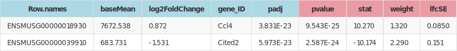

 
# LavaRuins - Interactive differential gene expression explorer

LavaRuins is a friendly interactive data visualizer for exploring mouse gene differential expression. LavaRuins is heavily inspired by [DEIVA](https://github.com/Hypercubed/DEIVA) and is built on the Plotly [Dash](https://plot.ly/products/dash/) framework.

Currently LavaRuins will read flat CSV or TSV files or Excel files, identified by file extension name (.csv, tsv or .xls*). The enforced column naming is exemplified below. Blue column names are currently required, and red column names are recommended but not currently required. The order of the columns in input files does not impact how LavaRuins reads those input files.

<!--Generate example DESEq file structure table-->
<!-- 
<table class="tg">
  <tr>
    <th class="tg-0pky", bgcolor="lightblue">Row.names</th>
    <th class="tg-0pky", bgcolor="lightblue">baseMean</th>
    <th class="tg-0pky", bgcolor="lightblue">log2FoldChange</th>
    <th class="tg-0pky", bgcolor="lightblue">gene_ID</th>
    <th class="tg-0pky", bgcolor="lightblue">padj</th>
    <th class="tg-0pky", bgcolor="#eb9ba3">pvalue</th>
    <th class="tg-0pky", bgcolor="#eb9ba3">stat</th>
    <th class="tg-0pky", bgcolor="#eb9ba3">weight</th>
    <th class="tg-0pky", bgcolor="#eb9ba3">lfcSE</th>
  </tr>
  <tr>
    <td class="tg-0pky">ENSMUSG00000018930</td>
    <td class="tg-0pky">7672.538</td>
    <td class="tg-0pky">0.872</td>
    <td class="tg-0pky">Ccl4</td>
    <td class="tg-0pky">3.831E-23</td>
    <td class="tg-0pky">9.543E-25</td>
    <td class="tg-0pky">10.270</td>
    <td class="tg-0pky">1.320</td>
    <td class="tg-0pky">0.0850</td>
  </tr>
  <tr>
    <td class="tg-0pky">ENSMUSG00000039910</td>
    <td class="tg-0pky">683.731</td>
    <td class="tg-0pky">-1.531</td>
    <td class="tg-0pky">Cited2</td>
    <td class="tg-0pky">5.973E-23</td>
    <td class="tg-0pky">2.587E-24</td>
    <td class="tg-0pky">-10.174</td>
    <td class="tg-0pky">2.290</td>
    <td class="tg-0pky">0.151</td>
  </tr>
</table> -->